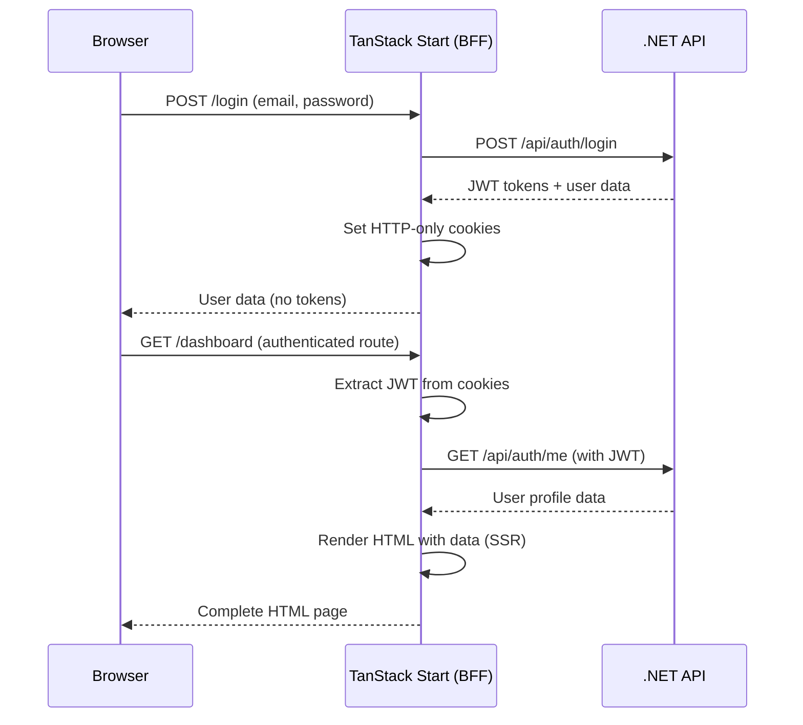

# ModernAPI Frontend Architecture Documentation

## Overview

This document outlines the comprehensive frontend architecture for the ModernAPI template - a production-ready, enterprise-grade React frontend that integrates seamlessly with the .NET backend through a Backend-for-Frontend (BFF) pattern using TanStack Start and Bun runtime.

## Table of Contents

1. [Architectural Philosophy](#architectural-philosophy)
2. [Technology Stack](#technology-stack)
3. [System Architecture](#system-architecture)
4. [BFF Pattern Implementation](#bff-pattern-implementation)
5. [Performance Strategy](#performance-strategy)
6. [Security Architecture](#security-architecture)
7. [Development Experience](#development-experience)
8. [Deployment Strategy](#deployment-strategy)
9. [File Structure](#file-structure)
10. [Integration Points](#integration-points)
11. [Scalability Considerations](#scalability-considerations)

## Architectural Philosophy

### Core Principles

1. **Separation of Concerns**: Clear distinction between presentation logic (frontend) and business logic (backend)
2. **Performance First**: Optimized for speed at every layer - Bun runtime, SSR, efficient bundling
3. **Type Safety**: End-to-end TypeScript with interfaces matching backend DTOs
4. **Security Excellence**: JWT tokens handled securely with HTTP-only cookies
5. **Developer Experience**: Modern tooling, hot reload, comprehensive error handling
6. **Scalability**: Architecture that scales independently from backend
7. **SEO Optimization**: Server-side rendering for optimal search engine visibility

### Design Goals

- **Best-in-Class Performance**: Match the quality and performance of the sophisticated .NET backend
- **Enterprise-Grade Security**: Production-ready authentication and authorization
- **Modern User Experience**: React 19 with concurrent features and smooth interactions
- **Maintainable Codebase**: Clean architecture with clear responsibilities
- **Future-Proof**: Built with 2025+ technologies and patterns

## Technology Stack

### Core Framework
- **React 19**: Latest stable with concurrent features and improved TypeScript support
- **TanStack Start**: Full-stack React framework with SSR, streaming, and server functions
- **TanStack Router**: Type-safe, file-based routing with automatic code generation
- **TypeScript**: Strict mode for comprehensive type safety

### Runtime & Build
- **Bun**: High-performance JavaScript runtime (4x faster than Node.js)
- **Vite**: Modern build tool with fast HMR and optimized bundling
- **Server Functions**: Type-safe RPC layer between client and server

### UI & Styling
- **Tailwind CSS**: Utility-first CSS framework for rapid UI development
- **Shadcn/ui**: Modern component library built on Radix UI + Tailwind
- **Lucide React**: Modern, customizable icon library
- **Framer Motion**: Animation library for smooth interactions

### State Management
- **Zustand**: Lightweight client-side state management (auth, UI state)
- **TanStack Query**: Server state management, caching, and synchronization
- **React Hook Form + Zod**: Form handling with TypeScript-first validation

### Development Tools
- **Biome**: Next-generation linter and formatter (100x faster than ESLint)
- **Vitest**: Fast unit testing framework
- **React Testing Library**: Component testing utilities
- **MSW (Mock Service Worker)**: API mocking for development and testing

## System Architecture

### Three-Layer Architecture

```
┌─────────────────────────────────────────────────────────────┐
│                    Browser Layer                            │
│  ┌─────────────────────────────────────────────────────────┐ │
│  │               React Application                         │ │
│  │  • User interactions and UI components                  │ │
│  │  • Client-side routing (post-hydration)                │ │
│  │  • State management (Zustand + TanStack Query)         │ │
│  │  • Form validation and submission                      │ │
│  └─────────────────────────────────────────────────────────┘ │
└─────────────────────┬───────────────────────────────────────┘
                      │ Server Functions (Type-safe RPC)
┌─────────────────────▼───────────────────────────────────────┐
│              TanStack Start Server (BFF Layer)             │
│  ┌─────────────────────────────────────────────────────────┐ │
│  │                Server Functions                         │ │
│  │  • SSR/Hydration coordination                          │ │
│  │  • JWT cookie management                               │ │
│  │  • Request/response transformation                     │ │
│  │  • Route-level data loading                            │ │
│  │  • Client-specific optimizations                       │ │
│  │  • API request proxying                                │ │
│  │  • Error handling and logging                          │ │
│  └─────────────────────────────────────────────────────────┘ │
└─────────────────────┬───────────────────────────────────────┘
                      │ HTTP API Calls (REST)
┌─────────────────────▼───────────────────────────────────────┐
│                .NET Backend API                             │
│  • Business logic and domain operations                    │
│  • Microsoft Identity Core authentication                  │
│  • PostgreSQL database operations                          │
│  • JWT token generation and validation                     │
│  • Clean Architecture (Domain/Application/Infrastructure)  │
└─────────────────────────────────────────────────────────────┘
```

### Layer Responsibilities

#### Browser Layer
- **Purpose**: User interface and interaction
- **Technologies**: React 19, TypeScript, Tailwind CSS
- **Responsibilities**:
  - Rendering UI components
  - Handling user input and form validation
  - Client-side routing and navigation
  - State management for UI and cached data
  - Optimistic updates and loading states

#### BFF Layer (TanStack Start Server)
- **Purpose**: Presentation logic and client optimization
- **Technologies**: Bun runtime, Server Functions, TanStack Router
- **Responsibilities**:
  - Server-side rendering for SEO optimization
  - Secure JWT token handling (HTTP-only cookies)
  - API request proxying and transformation
  - Route-based data loading and prefetching
  - Client-specific response optimization
  - Error handling and user feedback
  - Request logging and monitoring

#### Backend Layer (.NET API)
- **Purpose**: Business logic and data management (unchanged)
- **Technologies**: ASP.NET Core, Microsoft Identity, PostgreSQL
- **Responsibilities**:
  - All business rules and domain logic
  - User authentication and authorization
  - Data persistence and retrieval
  - JWT token generation and validation
  - API endpoint exposure

## BFF Pattern Implementation

### What is BFF (Backend for Frontend)?

The BFF pattern provides a dedicated backend service for each frontend application, optimizing the API surface for specific client needs without duplicating business logic.

### BFF vs Traditional API Integration

#### Traditional Approach (What we're avoiding):
```
Browser → .NET API (Generic endpoints)
```
**Issues**:
- No SSR (poor SEO)
- JWT tokens exposed to client JavaScript
- Generic API responses (not optimized for specific UI needs)
- Client handles all API complexity

#### BFF Approach (Our implementation):
```
Browser → TanStack Start (BFF) → .NET API (Business logic)
```
**Benefits**:
- SSR for optimal SEO and performance
- Secure JWT handling with HTTP-only cookies
- Client-optimized responses and data transformation
- Simplified client code with server functions

### Server Functions Implementation

Server functions provide type-safe RPC between the client and server, always executing on the server while being callable from both server and client contexts.

#### Authentication Server Function
```typescript
export const loginUser = createServerFn()
  .validator(LoginRequestSchema)
  .handler(async ({ email, password }) => {
    // Proxy request to .NET API
    const response = await fetch(`${process.env.API_BASE_URL}/api/auth/login`, {
      method: 'POST',
      headers: { 'Content-Type': 'application/json' },
      body: JSON.stringify({ email, password })
    })

    if (!response.ok) {
      throw new Error('Authentication failed')
    }

    const authResult = await response.json()
    
    // Secure JWT storage in HTTP-only cookie
    setHeader('Set-Cookie', `accessToken=${authResult.accessToken}; HttpOnly; Secure; SameSite=Strict; Max-Age=${15 * 60}`)
    setHeader('Set-Cookie', `refreshToken=${authResult.refreshToken}; HttpOnly; Secure; SameSite=Strict; Max-Age=${7 * 24 * 60 * 60}`)
    
    return authResult.user
  })
```

#### Protected Data Fetching
```typescript
export const getUserProfile = createServerFn()
  .handler(async () => {
    const cookies = getHeader('Cookie')
    const accessToken = extractTokenFromCookies(cookies, 'accessToken')
    
    if (!accessToken) {
      throw new UnauthorizedError('No access token found')
    }

    const response = await fetch(`${process.env.API_BASE_URL}/api/auth/me`, {
      headers: { 
        'Authorization': `Bearer ${accessToken}`,
        'Content-Type': 'application/json'
      }
    })

    if (response.status === 401) {
      // Attempt token refresh
      return await refreshTokenAndRetry()
    }

    return response.json()
  })
```

## Performance Strategy

### Server-Side Rendering (SSR)

#### Public Pages (Full SSR)
```typescript
// Marketing pages, documentation
export const Route = createFileRoute('/about')({
  loader: async () => {
    // Pre-fetch data on server
    const companyInfo = await getCompanyInfo()
    return { companyInfo }
  },
  component: AboutPage
})
```

#### Authenticated Pages (Hybrid SSR)
```typescript
// Dashboard, profile pages
export const Route = createFileRoute('/dashboard')({
  loader: async () => {
    try {
      const userProfile = await getUserProfile()
      return { user: userProfile, isAuthenticated: true }
    } catch (error) {
      // Redirect to login on server
      throw redirect({ to: '/login' })
    }
  },
  component: Dashboard
})
```

#### Client-Side Navigation
After hydration, all navigation becomes client-side for optimal UX:
```typescript
// Instant navigation after hydration
<Link to="/profile" preload="intent">Profile</Link>
```

### Caching Strategy

#### Server-Side Caching
```typescript
// Cache API responses at BFF layer
export const getCachedUserData = createServerFn()
  .handler(async ({ userId }) => {
    const cacheKey = `user:${userId}`
    
    // Check cache first
    const cached = await redis.get(cacheKey)
    if (cached) return JSON.parse(cached)
    
    // Fetch from API
    const userData = await fetchUserFromAPI(userId)
    
    // Cache for 5 minutes
    await redis.setex(cacheKey, 300, JSON.stringify(userData))
    
    return userData
  })
```

#### Client-Side Caching (TanStack Query)
```typescript
// Automatic caching and synchronization
const { data: user, isLoading } = useQuery({
  queryKey: ['user', userId],
  queryFn: () => getUserProfile(),
  staleTime: 5 * 60 * 1000, // 5 minutes
  gcTime: 30 * 60 * 1000 // 30 minutes
})
```

### Bundle Optimization

#### Code Splitting
```typescript
// Route-based code splitting (automatic)
const ProfilePage = lazy(() => import('./ProfilePage'))

// Component-based splitting
const HeavyChart = lazy(() => import('./components/HeavyChart'))
```

#### Asset Optimization
- **Images**: WebP/AVIF with fallbacks
- **Fonts**: Preloaded Google Fonts with font-display: swap
- **Icons**: Tree-shaken Lucide icons
- **CSS**: Purged Tailwind with critical CSS inlined

## Security Architecture

### JWT Token Handling

#### Secure Storage Strategy
```typescript
// Server-side token management
const setSecureTokens = (accessToken: string, refreshToken: string) => {
  setHeader('Set-Cookie', [
    `accessToken=${accessToken}; HttpOnly; Secure; SameSite=Strict; Max-Age=900`, // 15 min
    `refreshToken=${refreshToken}; HttpOnly; Secure; SameSite=Strict; Max-Age=604800` // 7 days
  ].join(', '))
}
```

#### Automatic Token Refresh
```typescript
export const refreshTokens = createServerFn()
  .handler(async () => {
    const cookies = getHeader('Cookie')
    const refreshToken = extractTokenFromCookies(cookies, 'refreshToken')
    
    const response = await fetch(`${process.env.API_BASE_URL}/api/auth/refresh`, {
      method: 'POST',
      headers: { 'Content-Type': 'application/json' },
      body: JSON.stringify({ refreshToken })
    })
    
    const tokens = await response.json()
    setSecureTokens(tokens.accessToken, tokens.refreshToken)
    
    return tokens
  })
```

### CSRF Protection
- **SameSite cookies**: Prevents cross-site request forgery
- **Origin validation**: Server functions validate request origin
- **CSRF tokens**: For state-changing operations

### Content Security Policy
```typescript
// Strict CSP headers
const securityHeaders = {
  'Content-Security-Policy': "default-src 'self'; script-src 'self' 'unsafe-inline'; style-src 'self' 'unsafe-inline'",
  'X-Frame-Options': 'DENY',
  'X-Content-Type-Options': 'nosniff',
  'Referrer-Policy': 'strict-origin-when-cross-origin'
}
```

## Development Experience

### Type Safety

#### Backend DTO Integration
```typescript
// Generated from .NET API
export interface UserDto {
  id: string
  email: string
  displayName: string
  firstName?: string
  lastName?: string
  isEmailVerified: boolean
  roles: string[]
}

export interface AuthResponse {
  accessToken: string
  refreshToken: string
  accessTokenExpiresAt: string
  refreshTokenExpiresAt: string
  user: UserDto
}
```

#### Route Type Generation
```typescript
// Auto-generated from file structure
export const Route = createFileRoute('/users/$userId')({
  params: {
    userId: string // Type-safe parameter
  },
  loader: async ({ params }) => {
    // params.userId is typed as string
    return await getUserById(params.userId)
  }
})
```

### Development Workflow

#### Hot Module Replacement
```bash
# Lightning-fast development server
bun run dev
# → Server starts in ~100ms
# → HMR updates in <50ms
# → TypeScript compilation in real-time
```

#### Testing Strategy
```typescript
// Unit tests for components
describe('LoginForm', () => {
  test('submits with valid credentials', async () => {
    const mockLogin = vi.fn().mockResolvedValue({ user: mockUser })
    
    render(<LoginForm onSubmit={mockLogin} />)
    
    await user.type(screen.getByLabelText('Email'), 'test@example.com')
    await user.type(screen.getByLabelText('Password'), 'password123')
    await user.click(screen.getByRole('button', { name: 'Login' }))
    
    expect(mockLogin).toHaveBeenCalledWith({
      email: 'test@example.com',
      password: 'password123'
    })
  })
})

// Integration tests for server functions
describe('loginUser server function', () => {
  test('authenticates valid user', async () => {
    const result = await loginUser({
      email: 'test@example.com',
      password: 'validPassword'
    })
    
    expect(result.user.email).toBe('test@example.com')
    expect(result.user.id).toBeDefined()
  })
})
```

### Error Handling

#### Global Error Boundary
```typescript
export function RootErrorBoundary({ error }: { error: Error }) {
  if (error instanceof NotFoundError) {
    return <NotFoundPage />
  }
  
  if (error instanceof UnauthorizedError) {
    return <Navigate to="/login" />
  }
  
  return <GenericErrorPage error={error} />
}
```

#### Server Function Error Handling
```typescript
export const protectedAction = createServerFn()
  .handler(async (data) => {
    try {
      return await performAction(data)
    } catch (error) {
      if (error instanceof ValidationError) {
        throw new TanStackStartError('Validation failed', {
          status: 400,
          data: error.errors
        })
      }
      
      // Log error for monitoring
      console.error('Server function error:', error)
      throw new TanStackStartError('Internal server error', { status: 500 })
    }
  })
```

## Deployment Strategy

### Containerization

#### Frontend Container (Bun Runtime)
```dockerfile
# Multi-stage build for optimal size
FROM oven/bun:1-alpine AS deps
WORKDIR /app
COPY package.json bun.lockb ./
RUN bun install --frozen-lockfile --production

FROM oven/bun:1-alpine AS builder
WORKDIR /app
COPY package.json bun.lockb ./
RUN bun install --frozen-lockfile
COPY . .
RUN bun run build

FROM oven/bun:1-alpine AS runner
WORKDIR /app
COPY --from=builder /app/.output ./

# Security: non-root user
RUN addgroup -g 1001 -S nodejs
RUN adduser -S nextjs -u 1001
USER nextjs

EXPOSE 3000
CMD ["bun", "run", "./server/index.mjs"]
```

#### Docker Compose Configuration
```yaml
version: '3.8'
services:
  frontend:
    build: 
      context: ./frontend
      dockerfile: Dockerfile
    ports:
      - "3000:3000"
    environment:
      - NODE_ENV=production
      - API_BASE_URL=http://backend:5000
      - REDIS_URL=redis://redis:6379
    depends_on:
      - backend
      - redis
    healthcheck:
      test: ["CMD", "curl", "-f", "http://localhost:3000/health"]
      interval: 30s
      timeout: 10s
      retries: 3

  backend:
    build: ./backend
    ports:
      - "5000:5000"
    environment:
      - ASPNETCORE_ENVIRONMENT=Production
      - ConnectionStrings__DefaultConnection=Server=postgres;Database=modernapi;User Id=postgres;Password=password;
    depends_on:
      - postgres

  redis:
    image: redis:7-alpine
    ports:
      - "6379:6379"
    command: redis-server --appendonly yes
    volumes:
      - redis_data:/data

  postgres:
    image: postgres:15-alpine
    environment:
      POSTGRES_DB: modernapi
      POSTGRES_USER: postgres
      POSTGRES_PASSWORD: password
    volumes:
      - postgres_data:/var/lib/postgresql/data
    ports:
      - "5432:5432"

volumes:
  postgres_data:
  redis_data:
```

### Environment Configuration

#### Development Environment
```bash
# .env.development
NODE_ENV=development
API_BASE_URL=http://localhost:5000
REDIS_URL=redis://localhost:6379
LOG_LEVEL=debug
```

#### Production Environment
```bash
# .env.production
NODE_ENV=production
API_BASE_URL=https://api.yourdomain.com
REDIS_URL=redis://redis:6379
LOG_LEVEL=info
SENTRY_DSN=your_sentry_dsn
```

### Monitoring and Observability

#### Health Checks
```typescript
// Health check endpoint
export const healthCheck = createServerFn()
  .handler(async () => {
    const checks = await Promise.allSettled([
      checkDatabase(),
      checkRedis(),
      checkBackendAPI()
    ])
    
    return {
      status: checks.every(check => check.status === 'fulfilled') ? 'healthy' : 'unhealthy',
      timestamp: new Date().toISOString(),
      checks: checks.map((check, index) => ({
        name: ['database', 'redis', 'backend'][index],
        status: check.status
      }))
    }
  })
```

#### Performance Monitoring
```typescript
// Performance metrics collection
export const performanceMiddleware = createServerFn()
  .middleware(async ({ next, request }) => {
    const startTime = Date.now()
    
    const result = await next()
    
    const duration = Date.now() - startTime
    
    // Log performance metrics
    console.log({
      method: request.method,
      url: request.url,
      duration,
      userAgent: request.headers.get('user-agent')
    })
    
    return result
  })
```

## File Structure

```
frontend/
├── src/
│   ├── components/          # Reusable UI components
│   │   ├── ui/             # Shadcn/ui base components
│   │   │   ├── button.tsx
│   │   │   ├── input.tsx
│   │   │   ├── card.tsx
│   │   │   └── index.ts
│   │   ├── forms/          # Form components
│   │   │   ├── LoginForm.tsx
│   │   │   ├── RegisterForm.tsx
│   │   │   └── ProfileForm.tsx
│   │   ├── layout/         # Layout components
│   │   │   ├── Header.tsx
│   │   │   ├── Navigation.tsx
│   │   │   ├── Sidebar.tsx
│   │   │   └── Footer.tsx
│   │   └── common/         # Common components
│   │       ├── LoadingSpinner.tsx
│   │       ├── ErrorBoundary.tsx
│   │       └── ProtectedRoute.tsx
│   ├── routes/             # File-based routing
│   │   ├── __root.tsx      # Root layout
│   │   ├── index.tsx       # Home page
│   │   ├── login.tsx       # Login page
│   │   ├── register.tsx    # Registration page
│   │   ├── dashboard/      # Dashboard section
│   │   │   ├── index.tsx
│   │   │   └── settings.tsx
│   │   └── profile/        # Profile section
│   │       ├── index.tsx
│   │       └── edit.tsx
│   ├── lib/                # Utilities and configurations
│   │   ├── api/            # API client and server functions
│   │   │   ├── auth.ts     # Authentication functions
│   │   │   ├── users.ts    # User management functions
│   │   │   └── client.ts   # HTTP client configuration
│   │   ├── utils/          # Utility functions
│   │   │   ├── cn.ts       # Class name utility
│   │   │   ├── format.ts   # Formatting utilities
│   │   │   └── validation.ts # Validation helpers
│   │   ├── hooks/          # Custom React hooks
│   │   │   ├── useAuth.ts
│   │   │   ├── useLocalStorage.ts
│   │   │   └── useDebounce.ts
│   │   └── stores/         # State management
│   │       ├── auth.ts     # Authentication store
│   │       └── ui.ts       # UI state store
│   ├── types/              # TypeScript type definitions
│   │   ├── auth.ts         # Authentication types
│   │   ├── user.ts         # User types
│   │   ├── api.ts          # API response types
│   │   └── global.ts       # Global type definitions
│   ├── styles/             # Styling
│   │   ├── globals.css     # Global styles and Tailwind imports
│   │   └── components.css  # Component-specific styles
│   └── app/                # App configuration
│       ├── router.tsx      # Router configuration
│       └── client.tsx      # Client entry point
├── public/                 # Static assets
│   ├── favicon.ico
│   ├── logo.svg
│   └── images/
├── tests/                  # Test files
│   ├── setup.ts           # Test configuration
│   ├── utils/             # Test utilities
│   ├── components/        # Component tests
│   └── integration/       # Integration tests
├── app.config.ts          # TanStack Start configuration
├── vite.config.ts         # Vite configuration
├── tailwind.config.ts     # Tailwind CSS configuration
├── biome.json            # Biome configuration
├── tsconfig.json         # TypeScript configuration
├── package.json          # Dependencies and scripts
├── bun.lockb            # Lock file
├── Dockerfile           # Container configuration
└── .env.example         # Environment variables template
```

## Integration Points

### Backend API Integration

#### Authentication Flow


#### Data Fetching Pattern
```typescript
// Route loader with authentication
export const Route = createFileRoute('/dashboard')({
  beforeLoad: async () => {
    // Check authentication on server
    const user = await getCurrentUser()
    if (!user) {
      throw redirect({ to: '/login' })
    }
    return { user }
  },
  loader: async ({ context }) => {
    // Parallel data fetching
    const [dashboardData, notifications] = await Promise.all([
      getDashboardData(context.user.id),
      getNotifications(context.user.id)
    ])
    
    return { dashboardData, notifications }
  },
  component: DashboardPage
})
```

### Error Handling Integration

#### API Error Mapping
```typescript
// Map .NET API errors to frontend errors
export const mapApiError = (error: ApiError): AppError => {
  switch (error.status) {
    case 400:
      return new ValidationError(error.detail, error.errors)
    case 401:
      return new UnauthorizedError(error.detail)
    case 403:
      return new ForbiddenError(error.detail)
    case 404:
      return new NotFoundError(error.detail)
    case 409:
      return new ConflictError(error.detail)
    default:
      return new ServerError(error.detail)
  }
}
```

#### RFC 7807 Problem Details Handling
```typescript
export const handleProblemDetails = (response: Response) => {
  if (response.headers.get('Content-Type')?.includes('application/problem+json')) {
    const problem: ProblemDetails = response.json()
    
    return {
      type: problem.type,
      title: problem.title,
      status: problem.status,
      detail: problem.detail,
      instance: problem.instance,
      requestId: problem.requestId,
      timestamp: problem.timestamp
    }
  }
  
  return response.json()
}
```

## Scalability Considerations

### Performance Scaling

#### Horizontal Scaling
```yaml
# Docker Compose with multiple frontend instances
services:
  frontend-1:
    build: ./frontend
    environment:
      - INSTANCE_ID=1
  
  frontend-2:
    build: ./frontend
    environment:
      - INSTANCE_ID=2
      
  load-balancer:
    image: nginx:alpine
    ports:
      - "80:80"
    depends_on:
      - frontend-1
      - frontend-2
```

#### Caching Strategy
```typescript
// Multi-layer caching
export const getCachedData = createServerFn()
  .handler(async ({ key, userId }) => {
    // L1: Memory cache (fastest)
    const memoryCache = getFromMemory(key)
    if (memoryCache) return memoryCache
    
    // L2: Redis cache (fast)
    const redisCache = await getFromRedis(key)
    if (redisCache) {
      setInMemory(key, redisCache, 60) // 1 minute
      return redisCache
    }
    
    // L3: Database/API (slowest)
    const data = await fetchFromAPI(key, userId)
    await setInRedis(key, data, 300) // 5 minutes
    setInMemory(key, data, 60) // 1 minute
    
    return data
  })
```

### Development Scaling

#### Micro-Frontend Preparation
```typescript
// Module federation setup for future micro-frontends
export const federationConfig = {
  name: 'shell',
  remotes: {
    dashboard: 'dashboard@http://localhost:3001/remoteEntry.js',
    profile: 'profile@http://localhost:3002/remoteEntry.js'
  },
  shared: {
    react: { singleton: true },
    'react-dom': { singleton: true }
  }
}
```

#### API Versioning Support
```typescript
// Version-aware API client
export const createApiClient = (version: 'v1' | 'v2' = 'v1') => {
  const baseUrl = `${process.env.API_BASE_URL}/api/${version}`
  
  return {
    auth: createAuthClient(baseUrl),
    users: createUsersClient(baseUrl),
    // ... other endpoints
  }
}
```

## Conclusion

This frontend architecture provides a sophisticated, performant, and maintainable foundation for modern web applications. By leveraging TanStack Start's server functions, Bun's performance benefits, and a well-structured BFF pattern, we achieve:

- **Optimal Performance**: 4x faster than traditional Node.js setups
- **Enterprise Security**: Secure JWT handling and CSRF protection
- **Excellent SEO**: Server-side rendering with real data
- **Developer Experience**: Type safety, hot reload, and modern tooling
- **Scalability**: Independent scaling from backend services
- **Future-Proof**: Built with cutting-edge 2025 technologies

The architecture maintains clear separation between presentation logic (frontend) and business logic (backend), ensuring that the sophisticated .NET API remains the authoritative source of truth while providing an optimal user experience through the React frontend.